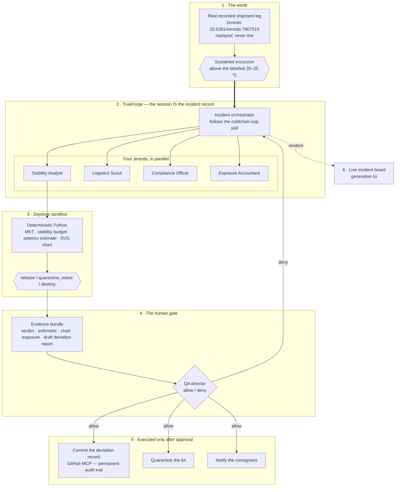

# ColdCall

> **Detection is a solved problem — sensors work. The unsolved gap is the _decision_: is this
> pallet still legally releasable, or must it be quarantined, retested, or destroyed? ColdCall
> is an agent that computes the actual regulatory disposition — mean kinetic temperature and
> stability-budget arithmetic, not a risk score — with a human holding the only pen that signs
> it.**

Built for **The Agent Harness Hackathon** (WeMakeDevs × TrueFoundry × Qodo) on
[TrueForge](https://github.com/truefoundry/trueforge). MIT licensed.

A temperature excursion happens mid-transit. ColdCall opens an incident, fans out four
specialist strands in parallel, runs deterministic regulatory maths in a sandboxed microVM,
assembles an evidence bundle, and then **stops** — holding every irreversible action for a
human. On approval it executes and commits a permanent audit trail.

## Why this is different from a risk score

Prior art in this space *predicts risk*. ColdCall *computes disposition*. That distinction is
the entire project:

|  | A risk score | A disposition |
|---|---|---|
| Where it comes from | A model | Arithmetic with a regulatory definition |
| Can a regulator re-derive it? | No | Yes — same inputs, same answer, every time |
| Can it be defended in a deviation investigation? | Not really | That is what it is *for* |

**The LLM never decides.** It gathers telemetry, orchestrates the investigation, explains the
result and drafts the paperwork. The verdict comes from `src/coldcall/disposition.py`, which is
dependency-free, unit-tested, and readable by anyone who doesn't trust the agent.

That is a checkable claim, not a slogan. The same leg scored on a laptop and inside a remote
Daytona microVM returns the same numbers to the digit: **MKT 24.54 °C, 64.35 % of budget
consumed, verdict `quarantine_retest`.**

## What is regulation and what is ours

Stated up front because it must never blur, and because it is the first thing worth asking of
any system like this.

| Anchored in regulation | ColdCall's own policy |
|---|---|
| The MKT formula — USP &lt;1079&gt;, ICH Q1A | The percent-of-budget thresholds that turn a number into a verdict |
| The labelled storage range, from the real openFDA label | The permitted excursion **duration** in hours |
| The permitted excursion **range**, from that same label | The Arrhenius potency estimate's parameters |
| Cumulative thermal stress over peak temperature — WHO TRS-999 Annex 5 | Which verdicts count as irreversible |

We checked rather than assumed: **no real drug label states a permitted excursion duration.**
Labels that pair "excursions permitted to 15–30 °C" with a number of hours are describing
post-reconstitution in-use stability, a different allowance entirely; USP &lt;659&gt; defines
controlled room temperature by temperature and MKT, not by a time ceiling. So the hours figure
is ours, is surfaced as an input, and is stamped `ColdCall demo policy — not a regulatory limit`
into every record the system emits.

## Architecture



## Every TrueForge feature, load-bearing

Not a checklist — each row is a place the system would break if the feature were removed.

| Feature | Where it carries weight |
|---|---|
| **Sandboxed execution** (Daytona) | The regulatory maths. It runs off-host so the verdict is reproducible by someone who does not trust our laptop. |
| **Human approvals** | The release/quarantine gate. Every irreversible action halts on `tool.approval_required`. |
| **Subagents** | Four strands answering one question each, in parallel. |
| **Skills** | `coldchain-sop` — the SOP, fetched from git at a pinned ref, that the agent must follow. |
| **Persistent sessions** | The session *is* the regulatory record. Proven against `kill -9` — see below. |
| **MCP connectors** | GitHub commits the deviation record. Supabase and Stripe are wired and gated, pending their OAuth logins. |
| **Generative UI** | The live incident board the operator reads before deciding. |

## Quickstart

Needs **Node 22+** (TrueForge segfaults on Node 20) and [`uv`](https://docs.astral.sh/uv/).
Python floor is **3.11**; we develop on 3.12, which is what the command below pins. Nothing is
installed globally.

The shell scripts additionally need **`curl`** and **`jq`**, plus **`lsof`** and **`shasum`**
for the restart proof only. Of these, **only `jq` usually needs installing** —
`brew install jq` or `apt install jq`; the rest ship with macOS and with most Linux
distributions. `verify_apis.sh`, `restart_proof.sh` and `daytona_gc.sh` each check for `jq` up
front and name it rather than failing halfway through; `setup_trueforge.sh` uses only `curl`.

**Step 1 runs in its own terminal and stays running.** It is a server, not a setup step —
everything after it goes in a second terminal.

```sh
# Terminal 1 — leave this running
npx @truefoundry/trueforge                 # → http://localhost:8790
```

```sh
# Terminal 2 — everything else
git clone https://github.com/Mulaydm10/ColdCall && cd ColdCall
uv venv --python 3.12 .venv && uv sync --group dev
uv run pytest                              # the maths, proven before you trust it

# 3. Keys, then configure the harness (both idempotent)
cp .env.example .env                       # add OPENAI_API_KEY and DAYTONA_API_KEY
./scripts/setup_trueforge.sh               # model provider, sandbox, connectors, skills
./scripts/setup_trueforge.sh --dry-run     # or see what it would do, change nothing

# 4. Check every external data source, for real
./scripts/verify_apis.sh                   # calls each API and asserts on the response

# 5. Run one incident, end to end
uv run python replay/incident.py           # stops at the gate and asks you
```

Step 5 halts and asks you to `allow` or `deny`. **That pause is the product.** `--auto allow`
exists for unattended smoke runs and prints a warning when used, because a gate that approves
itself is not a gate.

```sh
uv run python replay/engine.py --speed 60  # watch the excursion build in shipment-time
./scripts/restart_proof.sh <session-id>    # kill -9 the harness; prove the record survives
```

## The data is real, and here is exactly how real

Every claim below is checkable, and the honest limits are stated rather than buried.

| What | Source | Status |
|---|---|---|
| Shipment telemetry | Zenodo [`10.5281/zenodo.7907515`](https://doi.org/10.5281/zenodo.7907515), CC-BY-4.0 | **Real recorded data, replayed.** Never live. One leg, chosen and documented in [`replay/SHIPMENT.md`](replay/SHIPMENT.md) with its runners-up so the choice is auditable. |
| Product label | openFDA drug label API, set_id `e13cafe2-f226-4021-81d8-7bd1f98b5582` | **Real, keyless, re-fetchable.** "Store at 20° to 25°C; excursions permitted to 15° to 30°C." |
| Stability method | USP &lt;1079&gt; (MKT), WHO TRS-999 Annex 5 | Cited in the code and in every emitted record |
| Excursion allowance (hours) | **Nobody's label** | **Ours.** Labelled as policy everywhere it appears. |
| Potency figure | First-order Arrhenius model | **An estimate, not an assay.** Says so in the code, the JSON, the report and the SOP. |
| Shipment value, consignees, warehouses | [`replay/seed.json`](replay/seed.json) | Plausible demo fixture, marked as such. Consignee addresses are `@example.invalid` — non-routable by RFC, so no real person can be contacted. |

**What we do not claim.** The original build plan named a "VCC-CPLD" dataset with 445 000
cold-chain records. It does not exist — the DOI does not resolve and Zenodo returns zero hits.
Rather than cite an unresolvable source we substituted a real one and wrote down why
([`ADR-0003`](design/decisions/)). The substitute is ambient logistics freight, not refrigerated
cargo, so the product label was chosen to match what the goods actually are.

## Prior art, cited openly

- **AI Cargo Monitor** (UMD Smith Agentic AI Challenge winner, Apr 2026) — ML risk *prediction*
  with XGBoost + SHAP over a hand-built LangGraph cascade. ColdCall differs on all three axes:
  regulatory *disposition* instead of a risk score, real published telemetry instead of
  synthetic, and harness-native on TrueForge instead of a bespoke stack.
- **Ghost of Curie** (lablab Band of Agents, did not win) — simulation only, agents that
  discussed rather than acted, no approval gate, no quantified outcome. ColdCall does the
  opposite on each count.

## Proven, not asserted

| Claim | Evidence |
|---|---|
| The maths is deterministic and reproducible | Same leg, same verdict on a laptop and in a remote microVM: MKT 24.54 °C, 64.35 %, `quarantine_retest` |
| The sandbox is genuinely remote | A live turn returned `Linux x86_64 3.13.15` from a macOS/arm64 host |
| The gate actually stops the agent | **Deny** → it reported the denial and stopped, no retry. **Allow** → branch `incident/INC-VCC-118-A2231-…`, deviation record committed as `1c859fc` |
| The record survives a crash | `./scripts/restart_proof.sh` — `kill -9`, restart, and a **SHA-256 digest of every event's content** unchanged: `3c470830…` before and after, over **every field of every event** |
| The data sources work *now* | `./scripts/verify_apis.sh` calls each one and asserts on the response |

Full trail in [`experiments/experiment_log.md`](experiments/experiment_log.md) (`EXP-0001`–`EXP-0012`),
including the bugs that had to be fixed on the way and the ones still open.

## Honest limits

- **This is decision support.** It does not make regulated release decisions. A human QA
  director owns the release decision; the approval gate exists to enforce exactly that.
- **Sandboxes accumulate and Daytona's free tier is 30 GiB.** Each run leaves five or six
  ~3 GiB sandboxes behind. When the ceiling is hit the harness reports a *network* error, not a
  disk error, which sends you debugging the wrong thing while the agent silently runs without
  its SOP. `./scripts/daytona_gc.sh` diagnoses and reaps; setup now sets a 2-hour delete timer
  instead of 5 days.
- **The skill fetch is also a genuine cold-start race**, independently of the quota. Each
  strand gets its own sandbox and re-fetches the git-backed skill. `replay/incident.py` retries
  once on a fresh session and refuses to present a run whose skill never loaded.
- **Supabase and Stripe are wired but dark**, pending one browser OAuth login each. The data
  layer sits behind one interface with SQLite as today's working default, so authorising them
  is a backend swap rather than a rewrite. Nothing is mocked in the meantime.

## Repo map

| Path | What |
|---|---|
| `src/coldcall/` | The dependency-free payload uploaded into the sandbox: MKT, disposition, chart, report, store, CLI |
| `replay/` | The world — the replay engine, the incident driver, the seed fixture, the leg's provenance |
| `skills/coldchain-sop/` | The SOP the agent must follow, fetched from git at runtime |
| `agents/coldcall.agent.json` | The agent manifest: model, connectors, approval gates, skills, runtime features |
| `scripts/` | Idempotent setup, a real pre-demo API check, the report generator, the restart proof |
| `design/decisions/` | `ADR-####` — why the stack, the dataset and the architecture are what they are |
| `experiments/` | `EXP-####` — what was tried, what it returned, what we decided |
| `DEMO.md` | The scenario judges see, kept runnable at all times |

## Qodo Code Review Evidence

> Required by the hackathon: see `COMPETITION.md` → "Required process". This section must
> contain a link to at least one **merged** pull request with meaningful ColdCall code, one or
> two sentences on what Qodo surfaced and what we changed or intentionally dismissed, and a PR
> history showing the completed review, our decisions, and a follow-up review against the final
> code. The public PR link is the required evidence — screenshots cannot replace it.

**Policy:** every substantive change in this repo goes through a branch → pull request → Qodo
review → follow-up review → human merge. Direct pushes to `main` do not count as reviewed work.

**Status:** Qodo is installed on this repository and reviewing pull requests as of 2026-08-27.

- **Representative merged PR:** [#6 — the disposition core, the regulated maths that decides
  a shipment's fate](https://github.com/Mulaydm10/ColdCall/pull/6) (merged 2026-08-27).
- **What Qodo surfaced, and what we did.** Across the four milestone PRs Qodo raised **36
  findings over four review rounds**; **33 were fixed** and 3 dismissed in-thread with reasons.
  These were not lint. The most valuable ones:

  - **A regulatory bug in the core maths.** `disposition()` was reading only the label's
    *storage* range and ignoring its *permitted excursion* range. A real label states both —
    "store at 20–25 °C" **and** "excursions permitted to 15–30 °C" — so an 18 °C reading, which
    the label explicitly permits, was quarantining as a **freeze event**, while a brief 35 °C
    spike could release whenever the time budget and MKT stayed low. Wrong in both directions,
    in the arithmetic the whole project rests on.
  - **A safety gate that could authorise what nobody could read.** When the driver failed to
    resolve a pending tool call, it still offered the operator an `allow` — a gate that *looks*
    like oversight while manufacturing consent. It now fails closed.
  - **A retry that could repeat an irreversible action.** We added one retry to survive a flaky
    sandbox cold start; Qodo pointed out that a run can hit that failure *and* still reach an
    approval gate, so the retry could commit, notify and mutate inventory a second time.
  - **A predictable `/tmp` path feeding a destructive `DELETE`.**

  Three of the findings were **regressions from our own earlier fixes** — an `INSERT OR IGNORE`
  added for idempotence that silently swallowed constraint violations, a timestamp rule that
  rejected a legitimate input shape, an error handler that validated syntax but not structure.
  And one script needed three rounds for one underlying mistake: *enumerating what matters*. Its
  persistence check compared `0` against `0`, then equal cardinalities, then five hand-picked
  fields. It now hashes whole objects.

- **Dismissed, with reasons in-thread:** one rule fired repeatedly claiming the thesis was
  fabricated. Correct on the diff, wrong on the facts — the thesis was supplied by the Main
  Agent, and `VISION.md` reads `TODO` only because it is a LOCKED governing file an agent may
  not edit. The thesis is proposed in `proposals/VISION.md` for a human to apply, which is
  exactly what that rule should enforce.
- **PR history:** [all pull requests](https://github.com/Mulaydm10/ColdCall/pulls?q=is%3Apr) ·
  [PR #6's trail](https://github.com/Mulaydm10/ColdCall/pull/6) shows four rounds of review,
  our reasoning on each finding, and the follow-up review against the final code before a
  human merged.

## AI assistance disclosure

Required by the hackathon rules (AI coding assistants are allowed, but their use must be
disclosed, and every participant must be able to explain the architecture and the technical
decisions behind the submission).

- **Claude Code (Anthropic, Opus 5)** is used throughout as a pair-programmer and for repo
  research, documentation, and scaffolding. AI-authored commits carry a
  `Co-Authored-By: Claude` trailer, so the split is visible in `git log`.
- **Qodo** reviews the pull requests in this repository, as the event requires; see the
  section above for its current status and the evidence trail.
- Architecture and technical decisions are recorded by a human in `design/decisions/`
  (`ADR-####`) and are owned by the team, not by the assistant.

## End-of-session checklist

- [ ] `STATE.md` reflects current reality
- [ ] `worklog.md` has a dated + timestamped entry
- [ ] New experiments logged in `experiments/experiment_log.md`
- [ ] LOCKED-file edits logged in `GOVERNANCE.md`'s audit table
- [ ] Work claims in `STATE.md` released
